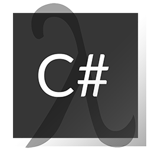

<!-- PROJECT SHIELDS -->
<!--
*** I'm using markdown "reference style" links for readability.
*** Reference links are enclosed in brackets [ ] instead of parentheses ( ).
*** See the bottom of this document for the declaration of the reference variables
*** for contributors-url, forks-url, etc. This is an optional, concise syntax you may use.
*** https://www.markdownguide.org/basic-syntax/#reference-style-links
-->


<!-- PROJECT LOGO -->
<br />
<p align="center">
  <a href="https://github.com/kiritchoukc/FunctionalArchitectureSample">
    
  </a>

  <h3 align="center">C# Functional Web Api</h3>

  <p align="center">
    This project uses <a href="">LanguageExt library</a> extensively to build a <strong>Todo</strong> Web Api in a functional way.
    <br />
    <!-- <a href="https://github.com/kiritchoukc/FunctionalArchitectureSample"><strong>Explore the docs �</strong></a> -->
    <br />
    <a href="https://github.com/kiritchoukc/FunctionalArchitectureSample/issues">Report Bug</a>
    |
    <a href="https://github.com/kiritchoukc/FunctionalArchitectureSample/issues">Request Feature</a>
    <br />
  </p>
</p>


<!-- TABLE OF CONTENTS -->
## Table of Contents

* [About the Project](#about-the-project)
  * [Built With](#built-with)
* [Getting Started](#getting-started)
  * [Prerequisites](#prerequisites)
  * [Installation](#installation)
* [Contributing](#contributing)
* [Contact](#contact)


<!-- ABOUT THE PROJECT -->
## About The Project

### Built With

* [.NET 5](https://dotnet.microsoft.com/download/dotnet/5.0)
* [C# 9](https://docs.microsoft.com/en-us/dotnet/csharp/whats-new/csharp-9)
* [LanguageExt](https://github.com/louthy/language-ext)
* [MediatR](https://github.com/jbogard/MediatR)
* [Docker](https://www.docker.com/)
  * [Docker-Compose](https://docs.docker.com/compose/)
  * [MongoDb](https://www.mongodb.com/)
  * [Mongo-Express](https://github.com/mongo-express/mongo-express)
  * [Redis](https://redis.io/)


<!-- GETTING STARTED -->
## Getting Started

To get a local copy up and running follow these simple steps.

### Prerequisites
* [Docker client](https://www.docker.com/get-started)

### Installation

1. Clone the repo
```sh
git clone https://github.com/kiritchoukc/FunctionalArchitectureSample.git
```
2. If using Visual Studio: `CTRL+F5`
2. Otherwise into the directory
   
```sh
docker-compose up -d
```


<!-- CONTRIBUTING -->
## Contributing

**Make this solution better by contributing !**

Any contributions you make are **greatly appreciated**.

1. Fork the Project
2. Create your Feature Branch (`git checkout -b feature/AmazingFeature`)
3. Commit your Changes (`git commit -m 'Add some AmazingFeature'`)
4. Push to the Branch (`git push origin feature/AmazingFeature`)
5. Open a Pull Request


<!-- CONTACT -->
## Contact

Clément Kiritchouk - [@CKiritchouk](https://twitter.com/@CKiritchouk) - clement.kiritchouk@protonmail.com

Project Link: [https://github.com/kiritchoukc/FunctionalArchitectureSample](https://github.com/kiritchoukc/FunctionalArchitectureSample)
